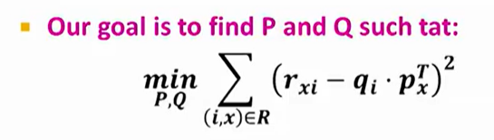

# book-recommend-Surprise

This project is to recommend books to readers based their book ratings from [Book-Crossing Dataset](http://www2.informatik.uni-freiburg.de/~cziegler/BX/), which contains 278,858 users providing 1,149,780 ratings about 271,379 books. To experiment and benchmark different recommendation systems, [Surprise scikit](http://surpriselib.com/) is used, which provides convenient tools to control experiment, handle dataset, adopt cross validation, adopt various ready-to-use prediction algorithms.

## What recommendation system for?

The long-tail problem is common especially in the digital market where the commodity stock is enormous. The graph below shows the distribution of ratings or popularity among items or products in marketplace. While popular items (highly rated by a large number of customers) in blue area consist of a significant part of market value, the unpopular or new items in green area also represent a remarkable share. To satisfy the demand in the long tail, customized recommendation to customers is critical.

  

## Types of recommendation systems

**Objective: to predict high ratings**

1. Content Based Recommendation

Content-based filtering methods are based on a description of the item and a profile of the user's preferences. These methods are best suited to situations where there is known data on an item (name, location, description, etc.), but not on the user. Content-based recommenders treat recommendation as a user-specific classification problem and learn a classifier for the user's likes and dislikes based on an item's features.

Similarities:
* Jaccard Similarity
* Cosine Similarity
* Centered Cosine Similarity

2. Collaberative Filtering: Neighborhood Methods

Collaborative filtering is a technique that can filter out items that a user might like on the basis of reactions by similar users. It works by searching a large group of people and finding a smaller set of users with tastes similar to a particular user. It looks at the items they like and combines them to create a ranked list of suggestions.

* User-user CF
* Item-item CF
* Combine baseline with CF

3. Collaberative Filtering: Latent factors Methods

Matrix factorization algorithms work by decomposing the user-item interaction matrix into the product of two lower dimensionality rectangular matrices.

Dimensionality reduction finds a subspace whose axes are effective representation of the data. Rank of matrix tells the number of linearly indepent columns of the matrix.

## Singular Value Decomposition

It's **always** possible to decompose a real matrix into left singular vector, sigma, right singular vector. The decomposition is unique. Left and right vectors are column orthonormal (i.e. U^T U = I, V^T V = I). Singular values are positive and sorted in decreasing order.

  

Users-to-Movies Example:
1. U: user -> movie concepts
2. Sigma: strength of each concept
3. V^T: movie -> movie concepts

SVD for dimensionality reduction: set smallest singular values to zero, best low rank approximation (i.e. spectral decomposition: matrix is the sum of k terms)

Rule-of-thumb on how many singular values to be kept: keep 80%-90% of 'energy' (i.e. sum of all squared singular values). 

Eigen-decomposition: matrix A must be symmetric

  

## Modern Recommender System

Multi-scale modeling of the data
1. **Global**: top level overall deviations of users/movies from average ratings, baseline estimation
2. **Factorization**: addressing regional effects
3. **Collaberative filtering**: extract local patterns, local neighborhood (CN/NN), derive unknnown ratings from those of "similar" movies (item-item variant)

## Latent Factor Recommender System

  

k factors latent space, e.g.:
1. Serious VS Funny
2. Geared towards females VS Geared towards males
...
100. Factor 100

SVD isn't defined when entries are missing! Use specialized methods to find P, Q and solve the optimization problem.

  

### Regularization

Large k (# of factors) -> tend to become overfitting -> hard to generalize for unseen data

Loss = Error + lamda * Length

### Stochastic Gradient Descent

  

